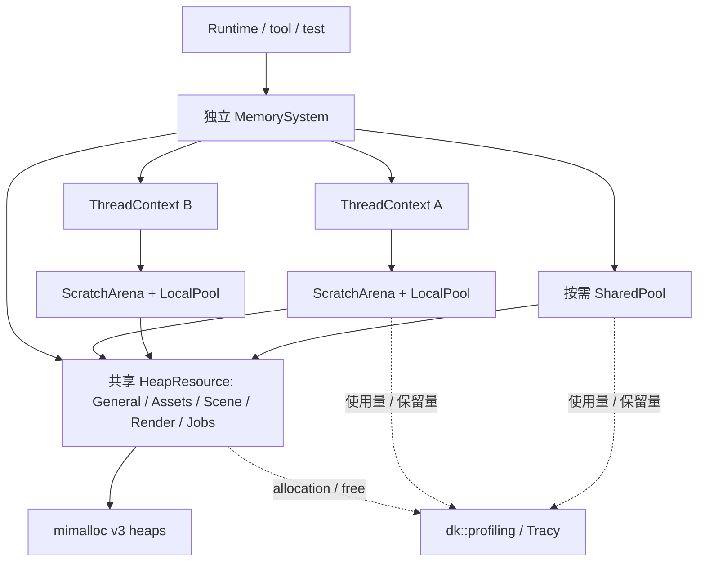

# Foundation Memory System 设计

## 目标与当前范围

为长期对象、跨线程数据和高频临时分配提供统一的所有权、对齐、预算与诊断规则。
通用 heap 使用 mimalloc，向上提供 PMR、标准容器 allocator、智能指针工厂、arena 和 pool。
与 [Tracy 性能分析](foundation-profiling.md) 一起作为 **M1.7 基础设施补充**，先于 M4 实施。
原 M1.1–M1.6、M2、M3 的验收保持有效。本文件是设计稿，尚无对应 C++、target 或已安装依赖。

优先解决不同生命周期和线程间移交的正确性，再依据测量决定优化；不承诺替换分配器就一定更快。
本模块管理 CPU 内存。VMA 继续负责 GPU allocation，GPU fence/延迟销毁由 graphics/render 管理。
不改变 Scene/Runtime 当前的单线程业务访问约束，不全局替换 malloc/new，不重写 STL 容器。

## 模块与依赖

- 计划目录 `engine/foundation/memory`，target `dk_memory / dk::memory`，命名空间 `dk::memory`。
- 公开头位于 `include/dk/memory/`：`MemorySystem.hpp`、`Resource.hpp`、`Allocator.hpp`、
  `SmartPtr.hpp`、`Buffer.hpp`、`Arena.hpp`、`Pool.hpp`、`Statistics.hpp`；按小节实现后再添加。
- 公共接口使用标准库及本模块类型；错误使用不分配内存的枚举/POD。首版不依赖 dk::core，
  Core 也不反向依赖 Memory。mimalloc 和 dk::profiling 为 PRIVATE 链接依赖。
- `mi_heap_t`、mimalloc 头文件和 Tracy 事件接口均留在实现内。上层按实际公开类型决定
  PUBLIC/PRIVATE 链接 dk::memory，不能用全局 include/link 注入。
- 计划 `DK_BUILD_MEMORY` 开关及 `memory` vcpkg feature；实施 M1.7.2 时添加，禁用模块不安装 mimalloc。

2026-09-23 核验：项目固定基线 `67b9e21f86e3034657a04da429a8bf274de67925` 和当时
官方最新提交 `9e3427bc82738568947beb508e78231f99c04f4c` 均提供 **mimalloc 3.5.3 / MIT**。
实施时重新核验 [三方库版本规则](../third-party-libraries.md)，要求 mimalloc **v3** 语义。
计划 `find_package(mimalloc 3 CONFIG REQUIRED)`，按 port 导出选择 `mimalloc-static` 或 `mimalloc`。
不启用 override feature，不运行注入工具，不设置进程或线程默认 heap。

## 实例、域与线程结构



`MemorySystem` 是可独立创建的装配对象，每个 Runtime/离线工具/测试可有自己的实例，显式注入使用者。
多个实例能同时存在；没有决定所有分配去向的单一全局 instance。SystemId/DomainId 是会话身份，
不写入资产或场景文件。域名称可配置，图中的类别是默认建议，不是固定全局数组。

每个 HeapResource 持有一个 v3 heap，作为子系统预算与生命周期边界。根据
[mimalloc 官方 heap 文档](https://microsoft.github.io/mimalloc/group__heap.html)，v3 heap 支持
多线程分配，内部按需管理线程局部 theap；v1/v2 的创建线程限制不能直接套用到 v3。
引擎无需给所有分配增加一把全局互斥锁。域属于逻辑分组，并非 OS 内存隔离或安全边界。

`ThreadContext` 在所属线程创建和销毁，绑定一个 MemorySystem，持有该线程的 scratch/local pool。
一个线程可以使用多个系统的独立 context；首版显式传递，不提供隐含全局 TLS allocator。
未来若加 TLS 查询，必须以 SystemId + generation 区分，并验证存活，不能缓存悬空裸指针。
MemorySystem 不创建 worker，也不替 Jobs 执行 join。

| 资源 | 分配线程 | 释放线程 | 回收时机 / 用途 |
| --- | --- | --- | --- |
| HeapResource | 多线程 | 任意线程 | 逐块释放；持久对象、跨线程结果 |
| ScratchArena | context 所属线程 | 同线程；单块释放不回收空间 | scope rewind/reset；解析与计算临时数据 |
| LocalPoolResource | 创建线程 | 创建线程 | 逐对象归还槽位；线程内部重复小对象 |
| SharedPoolResource | 多线程 | 任意线程 | 逐对象归还槽位；确有共享需求的小对象 |
| FrameArena（后续） | 每 frame-slot、每 worker 独立 | 所属执行域 | CPU 工作与相关 GPU 使用都结束后，由渲染方重置 |

线程安全分配器不使容器、对象或析构函数自动线程安全。具有渲染线程析构要求的对象，
仍由所属服务安排销毁；内存层不私自把析构回调移动到其他线程。

## 公共接口与资源存活

以下是拟定接口形状，非现有可编译示例；实施对应小节时补齐参数类型，不提前创建空接口。

```cpp
namespace dk::memory {
  class MemorySystem;        // create_heap、attach_thread、begin_close、try_close
  class ResourceHandle;      // 持有稳定 ResourceControl；只用于持久、线程安全资源
  class ThreadContext;       // 不可跨线程移动；scratch()、local_pool()
  class Buffer;              // 持有 ResourceHandle + pointer + size + alignment
  template<class T> class Allocator; // 持有 ResourceHandle；用于 std 容器/control block
  template<class T> using UniquePtr = std::unique_ptr<T, ResourceDeleter<T>>;
  // make_unique<T>(handle, args...) / make_shared<T>(handle, args...)
  // try_allocate(handle, bytes, alignment) -> expected<Buffer, AllocationError>
}
```

ResourceHandle 只能指向 HeapResource 或 SharedPoolResource。其 control 地址稳定，
不可因 MemorySystem 容器扩容而移动；内部 resource 继承 `std::pmr::memory_resource`。
Buffer、allocator 和智能指针 deleter/control block 持有 handle，保证异步结果存活期间资源仍在。
控制对象自身由独立 bootstrap 分配路径创建，禁止用自己尚未建好的 allocator 构造自己的 control。
资源只持有上游 handle，系统注册回指为非拥有关系，避免引用环。

**PMR 裸指针仅为借用。** `std::pmr::vector` 不拥有 memory_resource；调用者必须在容器析构之后
才释放其 ResourceHandle 或 ThreadContext。聚合对象先声明 owner、后声明 PMR 容器，利用逆序析构；
移动赋值也不能提前释放旧 owner，宜禁用默认生成的赋值并显式实现。返回跨线程数据优先使用
拥有 allocator 的标准容器/Buffer，不返回指向 scratch 的 span 或 PMR 容器。

`do_is_equal` 按 resource 身份判断；不同域即使都使用 mimalloc，也不能互相释放、绕过预算统计。
分配与释放必须配对同一资源及原 size/alignment。CRT free、delete、mi_free 和 pool 释放不可混用。
借用接口的所有权违规不保证可恢复，也不宣称能安全识别任意非法地址。

### PMR、容器与智能指针

- 使用标准 `std::pmr` 容器，不重写 vector/string，也不调用 `std::pmr::set_default_resource`。
  PMR 复制构造可能选择默认 resource，跨域复制必须显式传入目标 allocator，提供 `clone_to` 示例。
- `Allocator<T>` 保存拥有型 ResourceHandle，rebind 保留它，`is_always_equal=false`；
  copy/move assignment 和 swap 的 allocator propagation 均设为 true，复制构造保留原 handle。
  这与 PMR 的 propagation 规则不同，须独立测试，不能将两者混为一种容器语义。
- `make_unique<T>` 使用同资源分配/构造；构造抛异常则释放原块。deleter 保存原类型析构和分配信息。
  首版不提供数组工厂和隐式 Derived→Base 自定义 unique_ptr 转换，避免按 Base 大小释放；字节数组用 Buffer。
- `make_shared<T>` 通过标准 `std::allocate_shared` + 拥有型 Allocator 实现；复用 std::shared_ptr/weak_ptr。
  **最后一个 weak_ptr 释放前控制块仍可能存在，resource 也必须存活**，不能在 T 析构时销毁 heap。
- 持久智能指针工厂不接受 ScratchArena/LocalPool 借用指针。local pool 对象使用局部 lease，
  同线程、先于 pool 析构；不提供假装支持跨线程的 owning handle。

## 分配、错误和预算

低层 AllocationError 为固定大小错误枚举与数值：invalid_alignment、size_overflow、
limit_exceeded、out_of_memory、closing；错误处理不构造 dk::Error 字符串、不写同步日志。
原始申请先检查 alignment 非零且为 2 的幂，检查乘法/加法溢出；使用 aligned API 支持 Eigen 等过对齐类型。
零字节请求规范化为至少 1 字节并按规范化尺寸计费，Buffer 同时保留逻辑长度；不依赖 malloc(0) 的偶然行为。
有效对齐但后端无法满足时返回分配失败，不能返回对齐不足的地址。

`try_allocate` 返回不分配内存的 expected 错误；PMR/标准 allocator 路径失败抛 `std::bad_alloc`，
保持标准库约定。对象构造异常原样传播、回收存储；deallocate 不抛异常。资源耗尽不伪装成普通业务成功。
Buffer 扩容采用“分配新块 → 拷贝字节 → 交换 → 释放旧块”，失败保留旧内容；
不对任意 C++ 对象提供字节级 realloc。

每域 hard budget 限制**向 mimalloc 申请但未释放的规范化请求字节**，包含 arena/pool 的上游 chunk。
申请前原子预留额度，后端失败则撤回；父子资源不重复计费。不声称这是 mimalloc 内部占用或进程 RSS 上限。
零表示不设额度，所有加减经过溢出校验；元数据与 profiler 自身内存另列为观测范围之外。

统计区分 logical_live_bytes、backing_requested_bytes、retained_bytes、peak、allocation_count、failure_count。
heap 直接对象与其子 pool/chunk 的总账只在底层计一次；arena 的 used 包括 padding，并非活对象总大小。
预算及关闭计数需要精确同步，仪表盘快照可近似；不为所有小分配争用一个进程全局计数器。
可选细粒度统计/调试标签和调用栈，默认不在每次分配时格式化字符串或抓栈。

## Arena：成批临时内存

ScratchArena 是引擎的 chunk + bump allocator，**不同于 mimalloc 用于 OS 保留空间的 arena API**。
向指定 HeapResource 申请 chunk；快路径做关闭状态检查、线程内对齐、边界检查和指针推进，不逐块锁全局 heap。
暂定普通 chunk 64 KiB、scope 结束后最多保留 1 MiB 空闲容量，均可配置，性能测量后再调整。
超大请求使用独立 chunk，不无限抬高后续保留量；上游 budget 是实际增长上限。

`ScratchScope` 建立 checkpoint，严格 LIFO 退出；checkpoint 含 arena 身份、generation、chunk/offset。
内层 rewind 只收回内层分配，保留外层数据；过期 token、错线程、乱序退出属于契约错误。
arena 不可复制/跨线程移动，reset 只能在无活动 scope 的安全点执行。

不自动管理 C++ 对象析构。调用方先声明 scope，再构造依赖它的局部对象；对象先析构，scope 再 rewind。
PMR deallocate 对空间回收为空操作，`vector.clear()` 仍保留 capacity，不能据此认为 arena 可以重置。
已返回的地址/引用在 rewind 后失效；错误重置不能承诺由运行时完整检测。
构造失败时 RAII 清理已构造对象，scope 收回临时空间；扩 chunk 失败不修改已有 checkpoint 和可见数据。

M4 作业完成前将结果拷贝/构造到拥有 HeapResource 的 Buffer/容器，再通过 completion 移交。
取消和异常也先析构局部对象，再 rewind。未来 FrameArena 使用 frame-slot × worker，
由 M5/M7 的完成信号决定复用；不因 CPU 下一帧开始就覆盖 GPU 仍使用的数据。

## Pool：重复小对象

首版复用 `std::pmr::unsynchronized_pool_resource` / `synchronized_pool_resource`，
分别封装 LocalPoolResource / SharedPoolResource；上游为显式 HeapResource。
通过 pool_options 配置大小类别和每 chunk 块数，大块走上游；这些选项不等于总内存 hard limit。
不用一个全局 pool 包揽所有对象，也不先写无锁 freelist、远程释放队列和 ABA 回收算法。

ObjectPool<T> 是类型化构造/析构外观，验证 sizeof/alignof；构造失败归还槽位，销毁先调用 T 析构再归还。
局部 lease 保持同线程借用规则；跨线程 ObjectPool 使用 SharedPool + 持久 deleter/handle。
是否使用 pool 由实际对象大小、重复频率和基准结果决定，mimalloc 自身已处理很多小块场景。

`release/trim` 只在没有活动分配且无并发操作时执行，包装层忙时明确拒绝，不调用底层强制 release。
释放单个对象后空闲槽位可保留，因而 logical_live=0 不等于 backing=0；预算压力通过安全点 trim 释放。
SharedPool control 必须晚于所有对象/control block 销毁；LocalPool 必须在所属线程停止使用后销毁。

## 关闭、并发与提交点

系统及资源采用 `Open → Closing → Closed`，关闭不可回到 Open。
create_heap/attach_thread/注册表变更走冷路径互斥；共享资源快路径使用自己的操作闸门和计数。
入场必须以同一个原子协议协调状态与 in-flight 操作，不能“先读 Open，再无保护地访问已删除 heap”。
申请入场发生于 begin_close 之前的操作允许完成；关闭禁止后续入场，但始终允许合法释放。
arena/local pool 的 context 注册存活期间，系统不能销毁其底层资源；关闭通知通过原子状态传递，
下一次局部分配检查后拒绝，正在执行的局部分配允许结束。局部资源只能由所属线程 reset/销毁，
关闭线程不能替 owner 操作游标或 freelist；检查状态后仍处于运行中的 context 使 try_close 返回 busy。

| 操作 | 提交点 / 失败后的状态 |
| --- | --- |
| 创建域 | control、heap、标签都成功后加入注册表；失败不发布半个域 |
| 分配 | 额度预留与后端分配成功后记账/追踪，随后向调用者发布指针；失败撤回预留、不发 alloc 事件 |
| 释放 | 发匹配 free 事件后释放存储并结清计数；闸门覆盖整个过程，避免地址复用乱序 |
| arena rewind | 确认 scope/token/线程合法后修改游标；失败不修改旧游标，前提是用户已析构引用对象 |
| pool trim | 无活对象且排他取得维护权后释放空闲 chunk；忙时保留原状态 |
| begin_close / try_close | 先进入 Closing；若线程、操作或分配仍存活，返回固定大小 busy 摘要，保持 Closing 供重试 |

关闭按子资源到上游顺序进行：销毁 context / 清空 pool 保留 chunk，再关闭 heap。
try_close 允许已经空闲的域先关闭，busy 不回滚已完成的关闭；不应被理解为可继续分配的失败。
只有无活动操作、活分配和依赖子资源时才删除后端 heap；不使用 mi_heap_destroy 强制释放活对象。
虽然 mimalloc 的 heap delete 能保留活块，但这不能代替 C++ resource/control 的所有权保证。

正常宿主顺序：停止生产工作 → 请求取消并 join workers → drain/discard completion → 销毁服务、容器及
线程 context → try_close memory → 宿主结束性能分析。资源空闲后仍可存留 closed handle，申请会被拒绝。
MemorySystem 析构只发起关闭并释放自身所有权，不强杀 worker。外部 owning Buffer/shared/weak 持有
独立 control，允许在 Closing 中继续读取与释放已有数据；最后一个合法所有者完成后延迟清理。
借用 PMR/raw pointer 的使用者必须主动维持 owner，不能依赖延迟清理掩盖悬空引用。

## Tracy 联动与验证

分配事件的唯一默认入口为 HeapResource 后端申请/释放，分类为 backing；pool/arena 的子分配
通过计数曲线展示 logical/used/retained，不能再混入同一 heap 轨道累计。具体事件顺序、静态名称、
profiler 生命周期、开关和采集模式以 [性能分析设计](foundation-profiling.md) 为唯一规则。

验证按 M1.7 小节定向执行：对齐/溢出/预算回滚；多线程同域分配、异线程释放；两个 Runtime 隔离；
构造失败回收；allocator propagation；最后 weak_ptr 的控制块回收；嵌套 scope 与地址失效边界；
pool busy trim；有意控制的关闭/分配竞争；worker 退出后结果仍可释放；Tracy 同地址复用事件配对。
使用 barrier/latch 与可控失败上游，避免靠 sleep 或真实耗尽系统内存制造故障。
错线程与过期 checkpoint 通过调试诊断验证，不能把未定义行为测试当作正常恢复路径。

最终测量同一 Release/RelWithDebInfo 工作负载：heap、PMR、arena、local/shared pool，
不同尺寸/对齐、同线程与跨线程、1/2/4/N 线程；记录吞吐、延迟分布、峰值、保留量及 profiling 开销。
固定输入、机器、编译器、版本和线程数；Tracy 开/关分别测量，不设与硬件无关的“必须提速百分比”。
Thread sanitizer/ASan 仅在支持的构建配置实际执行后记录，不能由功能测试推定无数据竞争。

## 实施与迁移边界

按 [Roadmap M1.7](../roadmap.md#m17memory-与性能分析补充) 的七个小节实施：
Tracy CPU 底座 → heap → PMR/智能指针 → arena → pool → context/关闭集成 → 场景测量。
生命周期闸门、拥有型 handle 和最小记账从 heap 首节就具备，不能留到最后补救悬空资源。
首轮只在受控示例与新 M4 的大块数据/临时工作中采用，不批量改变 M1–M3 公共容器 ABI。
Tracy 的现有 Runtime/IO 埋点可先接入，不需要等待容器迁移。

flecs、JSON、fastgltf、stb 等自有分配不自动受本系统管理；以后使用库的 allocator hook 时，
分别验证完整 alloc/realloc/free 配对、回调并发与 context 存活。未接入的分配不计作已覆盖。
自定义 lock-free pool、NUMA 策略、全局分配替换、逐对象 arena 追踪以及 GPU arena 均为后续按测量立项。
当前待测的是 chunk/pool 参数与追踪开销，不影响既定的所有权和线程契约。

参考：[标准 memory_resource / pool](https://eel.is/c++draft/mem.res)、
[mimalloc 3.5.3 公共头](https://github.com/microsoft/mimalloc/blob/v3.5.3/include/mimalloc.h)、
[Jobs](foundation-jobs.md)、[资产运行时](assets-runtime.md)、
[0022 设计记录](../development/0022-memory-profiling-design.md)。
