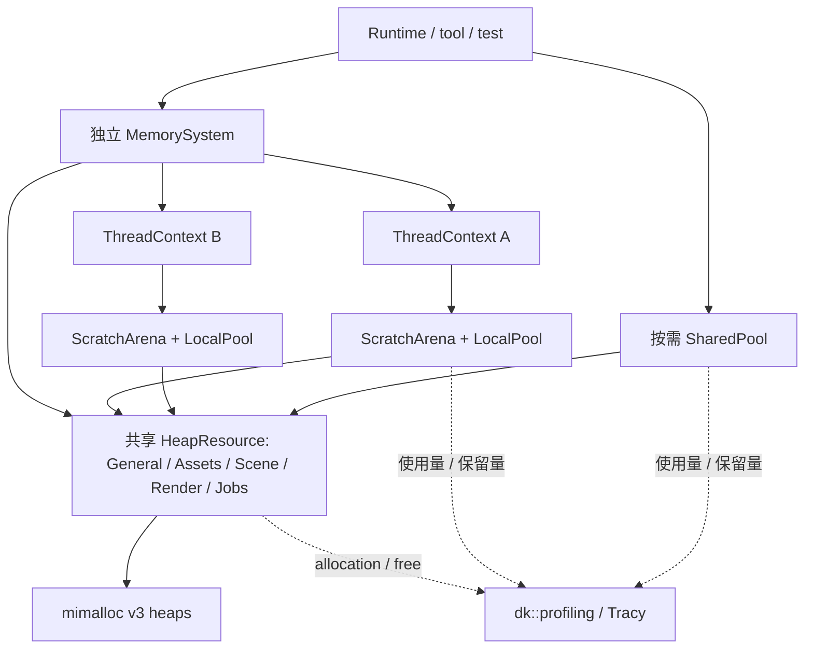

# Foundation Memory System 设计

## 目标与当前范围

为长期对象、跨线程数据和高频临时分配提供统一的所有权、对齐、预算与诊断规则。
通用 heap 使用 mimalloc，向上提供 PMR、标准容器 allocator、智能指针工厂、arena 和 pool。
与 [Tracy 性能分析](foundation-profiling.md) 一起作为 **M1.7 基础设施补充**，先于 M4 实施。
原 M1.1–M1.6、M2、M3 的验收保持有效。M1.7.2 已完成 heap 实现及定向验收，记录见
[0024](../development/0024-mimalloc-heap.md)。M1.7.3 已完成 PMR、Buffer、拥有型分配器/智能指针与
最小 context/持久域路由，见 [0025](../development/0025-memory-ownership-routing.md)。M1.7.4 提供 ScratchArena、
嵌套 ScratchScope 与用量曲线，见 [0026](../development/0026-scratch-arena.md)。M1.7.5 提供局部/共享 Pool、
ObjectPool 与受控 trim，见 [0027](../development/0027-memory-pools.md)；context 装配及任务路由仍待实现。

## M1.7.5 实施细化

开发记录 [0027](../development/0027-memory-pools.md)。沿用标准 PMR pool，不增加依赖；
本节提供独立 pool，ThreadContext 的统一 local_pool 装配/退休留在 M1.7.6。

- `LocalPoolResource` 为不可复制/移动的线程专属借用 PMR，内部 unsynchronized_pool_resource；
  `SharedPoolResource` 为可复制的拥有型句柄，稳定 control 内为 synchronized_pool_resource。
  两者固定持有上游 heap ResourceHandle，不改写其语义；共享池新增独立 PoolAllocator，避免扩大 heap handle 的关闭/路由接口。
  默认 PMR 与已有持久工厂不会自动改用 pool。pool_options 是标准实现可调整的提示，不是预算，实际 options 可查询。
- 上游计数 PMR 适配器通过 heap 分配标准库 chunk/运行期元数据；拥有型 control 及下述 MSVC Debug 构造元数据使用 bootstrap 存储。
  分配前验证零字节/对齐/溢出，规范化 size=0 为 1。上游错误保留固定枚举，PMR/allocator 对外抛 bad_alloc。
  失败不发布用户块、不增加 logical/live；标准库允许保留已取得的内部存储，因此不承诺 backing 完全不变，仍受 heap budget 约束。
- 每池 gate 协调在途操作、Closing 和排他维护；共享分配保持并发，由 synchronized_pool_resource 管理内部同步。
  分配计数成功后、离开 gate 前发布；释放先完成标准库 deallocate 再减少 live。Closing（含上游 Closing）拒绝缓存分配，允许释放。
  `try_trim()` 只在零在途且零 live 时回收标准后端，否则返回 busy 且不改变状态；trim 不关闭池，后续可重用。
  实施核验 MSVC Debug 的 release 后仍保留容器 proxy 元数据；因此成功 trim 完整析构标准后端，下一次申请才延迟重建。
  共享池用冷路径初始化 mutex 和 acquire/release ready 标记保护重建；正常分配不进入该 mutex。
  完整销毁同样用于 close，避免 Closed 后仍占用上游；重建失败不发布用户块，下一次可以重试。
  当前 MSVC Debug 的标准 pool 构造声明 noexcept，但会申请 iterator proxy。仅在 `_MSC_VER && _ITERATOR_DEBUG_LEVEL>0`
  时，构造期请求使用 control 内 256 字节对齐保留区（当前工具链实际 16 字节），避免可注入的上游失败穿过 noexcept。
  该存储属于 bootstrap control，不计 heap backing；构造完成后的全部请求仍走计数上游。重建时旧后端已销毁，才复用此区。
  这是针对已验证 STL 的有界兼容处理；升级工具链需重跑构造/重建故障测试，保留区不足视作不支持的 STL 布局并 terminate。
  `try_close()` 先关闭入场，busy 时保留存储，零 live/在途时 release 并发布 Closed；最后 control 销毁不得有活块。
  局部 try 接口错线程明确拒绝；错线程释放/析构属契约错误。共享句柄的复制品可并发使用，同一个句柄对象的赋值/销毁仍需外部同步。
  Shared try_close 返回 CloseResult，Local try_close 返回 expected<CloseResult, AllocationError> 以携带 wrong_thread；
  Local begin_close 是同线程契约接口。options() 保存首次后端构造时的实际配置，trim 不重置 lifetime 峰值/计数。
- `ObjectPool<T>` 借用 LocalPoolResource，make 返回带同线程 deleter 的 unique_ptr；
  `SharedObjectPool<T>` 拥有 SharedPoolResource，make 返回拥有型 unique_ptr，make_shared 通过 PoolAllocator 保留控制块资源。
  构造遵循 uses_allocator，构造失败归还槽位；析构函数执行期间 live 仍非零，防止重入 trim 提前释放。
  最后 weak_ptr 释放前 shared 控制块仍算活分配。普通成员不会被反射改路由；需要嵌套传播的类型声明 allocator_type。
- PoolSnapshot 区分 normalized logical_live_bytes、backing_bytes、peak、live/in-flight 和累计申请/失败。
  `idle_backing_bytes` 只在池没有活分配和在途操作时报告全部保留量；活跃池内部的空槽/碎片/元数据无法由标准 API 精确拆分。
  snapshot 为非事务诊断采样，不可据此判断可以 trim；安全点 `try_sample()` 取得排他采样权，不在每次子分配加全局观测锁。
- Tracy 仅在 heap 记录 backing alloc/free。local/shared 各自提供 live、backing、idle-backing、sampled-peak 固定汇总曲线，
  trim 前后、构造/析构及显式 try_sample 更新；峰值为采样历史值。Grow/Trim CPU zone 只包围上游申请/维护。
  OFF/CPU-only 内存曲线为空；共享 control 的最后一次采样归零。

验收：局部/共享对齐与零字节、缓存复用、过大请求、预算/OOM、已有数据保留、构造异常、allocator 传播、
跨线程释放、weak 控制块、busy trim/close、受控在途申请和释放竞争，以及真实 Tracy backing 配对与曲线禁用。
标准行为依据 [pool members](https://eel.is/c++draft/mem.res.pool.mem)；不依赖某个 STL 的 chunk 大小或地址复用顺序。

## M1.7.4 实施细化

开发记录为 [0026](../development/0026-scratch-arena.md)。本节只实现 scratch，不提前加入 pool、RoutingToken 或 worker 缓存。

- `ScratchArena` 是不可移动的线程专属 PMR resource，拥有固定上游 ResourceHandle；按 chunk 申请，普通分配只推进游标。
  默认 chunk 64 KiB、空闲保留上限 1 MiB；超过 chunk 大小的申请使用独立大块，rewind 时立即归还。
  冷路径 chunk 元数据使用普通 new，不算入 backing；用户数据全部通过上游 heap。
- checkpoint 是带 arena 身份、generation、单调序号和深度的不透明 token；只允许同线程、同 arena、严格 LIFO rewind。
  rewind 消费 token，重复/错序/跨 arena token 不改状态；reset 只允许无活动 checkpoint，释放缓存并递增 generation。
  reset 不清零 lifetime peak、allocation_count/failure_count，当前用量与保留容量归零。
  零字节规范化为 1；对齐须为 2 的幂，大小/对齐及累计字节数检查溢出。无活动 checkpoint 不允许分配。
  新 chunk 先准备元数据与 backing，成功后才接入活动链；失败保留已有地址、内容、游标和 checkpoint。
- `ScratchScope` 自动取得当前 ThreadContext 的 arena 并建立 checkpoint；析构回退。显式 `ScratchScope(arena)`
  不修改 TLS，适合独立算法/测试。先声明 scope 再声明 PMR 容器，容器必须先析构；arena 不记录或调用对象析构。
  PMR deallocate 不回收游标；借用对象不能逃出其 scope 或跨线程。错线程/错序析构是契约错误并 terminate。
- `ThreadContext(system, scratch_upstream, options)` 在入口配置一次 scratch，验证上游属于同系统；chunk 延迟分配。
  原 `ThreadContext(system)` 保持仅持久分配用途。`scratch_vector<T>()` 要求当前帧有活动 ScratchScope，缺配置/作用域明确报错。
  DomainScope 继承当前 scratch，持久域切换不改 backing 归属；每次 ExecutionScope 都从未绑定 scratch 开始，嵌套系统不继承旧 scope。
  context 销毁先释放 scratch 缓存，再解除系统 lease。Closing 后连缓存内 bump 都拒绝，但 rewind/reset/析构仍允许清理。
- 快照区分 requested（规范化申请之和）、used（含对齐 padding 的游标）、backing（全部 chunk 容量）、
  retained（完全空闲缓存 chunk 容量）；活动 chunk 的剩余尾部不计 retained，所以 used+retained 不一定等于 backing。
  per-arena peak 精确记录；这些数不是 RSS，也不能与 heap backing 相加当总内存。
- Tracy 只由上游 heap 发 chunk alloc/free，不为小分配重复发事件。固定 `dk/scratch/used`、`retained`、`backing`、
  `sampled-peak` 四条全局汇总曲线在 checkpoint、rewind 前后、chunk 增长、reset 和显式 sample 安全点更新。
  汇总使用冷路径 mutex，各 arena 保存上次贡献；析构撤销贡献。sampled-peak 是采样总 used 峰值，不声称是并发瞬时精确峰值。
  profiling OFF 或仅 CPU profiling 时无内存曲线；普通 bump 不加全局锁。

验收覆盖嵌套/代际/对齐、受控预算/OOM 失败、缓存复用和大块归还、异常时先析构后 rewind、自动路由隔离、
错线程和 Closing 清理。新增 Tracy 曲线须真实 capture/readback，核对归零、采样峰值和只含 chunk 的配对内存事件。

## M1.7.3 实施细化

本节在 M1.7.2 上增加以下接口，开发记录为 [0025](../development/0025-memory-ownership-routing.md)。
不增加新三方库，也不迁移既有 Scene/Runtime 容器。

- `ResourceHandle::pmr_resource()` 返回稳定 control 内的借用 PMR 接口，按身份比较；空 handle 返回
  null_memory_resource，不落到全局默认 heap。申请失败转 bad_alloc；调用者保持 owner 到最后一次 deallocate。
- `Allocator<T>` 拥有资源，默认构造通过 current_resource 捕获；显式构造无 TLS 副作用。
  复制、rebind 和移动保留同一 owner（移动也保持源 allocator 有效）；三个 propagation trait 均 true。
  分配溢出抛 bad_array_new_length，其他分配失败 bad_alloc；不自定义 construct，嵌套传播使用标准 scoped_allocator。
- `dk::Vector<T>`、`dk::String` 为 std 别名。跨域 clone 使用显式 allocator 的标准复制构造；
  PMR clone 也显式传目标 resource，不能假定其默认复制保留原域。
- `Buffer` 为 move-only 字节所有者，保存 resource/原 size/alignment。显式 try_allocate 返回 expected；
  try_resize 在同资源申请候选、复制 min(old,new)、交换后释放旧块，失败保留地址/内容/大小。
  同大小为 no-op，其他调整有新旧块同时占用预算的瞬时需求，新增字节未初始化；零长度仍拥有一个规范化块。
- unique/shared 工厂提供隐式与 `_in` 两组。显式工厂采用标准 uses_allocator 构造，支持声明 allocator_type
  的资源敏感类型；普通成员容器不会被反射或强制改路由。unique 不支持数组/Derived 到 Base 隐式转换。
  shared 通过 allocate_shared 和拥有型 allocator 保存控制块，最后 weak_ptr 释放前 owner 仍在。
  工厂支持 const 结果；unique 用标准 uses_allocator 参数和 placement new 构造，失败释放原始存储。
  unique 的 reset/null 赋值保留 deleter 的 owner，销毁或显式用空 UniquePtr 替换才放弃该句柄。
- `ThreadContext context{system}` 在当前线程注册最小 lease，不可复制/移动；本节无 scratch/pool。
  注册与系统 Closing 由 registry mutex 串行化；CloseResult 增加 active_contexts。
  有 context 时系统 try_close 保持 Closing 并延后 heap 删除；context 析构可晚于系统包装对象。
- ExecutionScope(context, resource) 和 DomainScope(resource) 为不可移动的栈帧，严格同线程/LIFO。
  前者允许嵌套另一系统，后者仅允许当前系统。验证成功后才发布 TLS，失败不改变旧帧。
  空上下文/资源、错线程/系统、Closing 分别返回固定 ContextErrorCode；普通入口抛静态消息 ContextError。
  try_current_resource 返回 expected；无绑定不默选全局资源。作用域错序/错线程销毁属契约错误并 terminate。
- Context 持有共享系统状态，scope 持有资源且借用 context；context 必须晚于 scope 析构。
  系统 ID 不复用，context 本节无缓存/重置，因此不另造可失效 generation；缓存/token 在 M1.7.6 再实现。
  Closing 后路由查询拒绝新工作，已有 allocator/Buffer/智能指针仍可释放；原资源本身的 gate 负责最终申请许可。

验收覆盖 PMR 身份/借用、预算/构造失败、allocator 传播及移动后复用、过对齐、Buffer 强失败保证、
weak 控制块延迟释放、缺上下文、嵌套/异常恢复、显式与隐式成员路由、scoped_allocator、线程隔离和 context 关闭。
默认仅运行 memory 相关 Debug 测试；新增拥有型链路用确定性 sink 检验事件只由 heap 发出，不重复全量 capture。

## M1.7.2 已确定的实现契约

- MemorySystem 为 move-only 装配对象，create 返回 expected；create_heap 接收名称、分类和 hard budget。
  名称复制到稳定 control，可重名；SystemId 进程内单调、DomainId 在系统内单调，0 表示空句柄。
- ResourceHandle 拷贝拥有 control；本节 try_allocate 返回原始 void*，deallocate 必须配对原始
  bytes/alignment，并保持至少一个 handle 活到释放完成。空指针释放为空操作，非法地址/错资源/重复释放
  是调用契约错误，不承诺恢复；下一节的 Buffer/allocator 自动维持该所有权。
- 每域原子 gate 把 Closing、维护状态及活动操作计数放在同一个字中。分配取得 gate 后再检查系统
  Open；系统关闭先发布 Closing 再关闭所有域入场。已入场分配允许完成，释放在 Closing 中继续入场。
  try_close 只有排他取得零活动 gate 后才检查 live 计数；存在活块则恢复 Closing 返回 busy，
  无活块才 mi_heap_delete 并发布 Closed，避免计数检查与删除之间的竞争。
- 系统注册表用冷路径 mutex；资源持有独立 shared SystemState，不回持注册表，避免引用环。
  系统析构发起关闭并放弃注册表所有权，外部 handle 保持 control/heap 存活，最后合法所有者延迟清理。
  本节尚无 ThreadContext；其注册 lease 在 M1.7.3 起加入，不预建空接口。
- 预算 CAS 预留 reserved_bytes（活块加在途请求），后端失败撤销预留；backing_requested_bytes、
  live_allocations 和 peak 仅在成功时更新。零字节计费 1；对齐必须为 2 的幂，保守限制 size+alignment-1
  不超过 PTRDIFF_MAX，checked_byte_size 处理乘法溢出。失败为固定枚举，不构造错误字符串。
- 快照为原子字段的非事务采样，静止时精确；预算与删除判断使用同步计数，不能从采样推断可销毁。
  allocation_count/failure_count 是诊断累计数；域分类用于 Tracy 固定标签，名称不传入热路径。
- 内部测试入口允许替换 backend/sink，以确定性制造 heap 创建失败、分配失败、地址复用和关闭竞争；
  不提供公开 observer 或回调配置，测试上下文必须比所有测试资源活得久。
- 默认 DK_BUILD_MEMORY=OFF，windows-dev/profiling 启用；memory feature 仅安装 mimalloc，无 override。
  DK_PROFILE_MEMORY 默认 ON，但仅在 DK_ENABLE_PROFILING 同时开启时发实际 heap alloc/free 事件。
  预算和所有权检查独立于采集；本节 backing 用量由快照与 Tracy 内存事件给出，不逐分配重复发 plot。

真实内存采集使用匹配 Tracy server 读回工具检查 named pool、大小、跨线程释放和零残留。
该工具独立于引擎构建，CPU csvexport 仍负责 CPU 区间，不用 CPU zone 数量代替内存事件验收。

优先解决不同生命周期和线程间移交的正确性，再依据测量决定优化；不承诺替换分配器就一定更快。
本模块管理 CPU 内存。VMA 继续负责 GPU allocation，GPU fence/延迟销毁由 graphics/render 管理。
不改变 Scene/Runtime 当前的单线程业务访问约束，不全局替换 malloc/new，不重写 STL 容器。

## 模块与依赖

- 目录 `engine/foundation/memory`，target `dk_memory / dk::memory`，命名空间 `dk::memory`。
- 已提供 [MemorySystem.hpp](../../engine/foundation/memory/include/dk/memory/MemorySystem.hpp)、
  [Resource.hpp](../../engine/foundation/memory/include/dk/memory/Resource.hpp)、
  [Allocator.hpp](../../engine/foundation/memory/include/dk/memory/Allocator.hpp)、
  [Buffer.hpp](../../engine/foundation/memory/include/dk/memory/Buffer.hpp)、
  [SmartPtr.hpp](../../engine/foundation/memory/include/dk/memory/SmartPtr.hpp)、
  [Context.hpp](../../engine/foundation/memory/include/dk/memory/Context.hpp)、
  [Containers.hpp](../../engine/foundation/memory/include/dk/memory/Containers.hpp)、
  [Arena.hpp](../../engine/foundation/memory/include/dk/memory/Arena.hpp)、
  [Pool.hpp](../../engine/foundation/memory/include/dk/memory/Pool.hpp)、
  [PoolAllocator.hpp](../../engine/foundation/memory/include/dk/memory/PoolAllocator.hpp)、
  [ObjectPool.hpp](../../engine/foundation/memory/include/dk/memory/ObjectPool.hpp)。
- 公共接口使用标准库及本模块类型；错误使用不分配内存的枚举/POD。首版不依赖 dk::core，
  Core 也不反向依赖 Memory。mimalloc、dk::profiling 和 Threads::Threads 为 PRIVATE 链接依赖。
- `mi_heap_t`、mimalloc 头文件和 Tracy 事件接口均留在实现内。上层按实际公开类型决定
  PUBLIC/PRIVATE 链接 dk::memory，不能用全局 include/link 注入。
- 已添加 `DK_BUILD_MEMORY` 开关及 `memory` vcpkg feature；禁用模块不自动选择 mimalloc。

2026-09-23 初次核验：当时项目基线 `67b9e21f86e3034657a04da429a8bf274de67925` 和当时
官方最新提交 `9e3427bc82738568947beb508e78231f99c04f4c` 均提供 **mimalloc 3.5.3 / MIT**。
M1.7.2 再次核验官方 master 仍为 33d78c1e，安装并接入 mimalloc 3.5.3；当前基线见三方库说明。
遵循 [三方库版本规则](../third-party-libraries.md)，要求 mimalloc **v3** 语义。
使用 `find_package(mimalloc 3 CONFIG REQUIRED)`，优先链接导出的 `mimalloc`，兼容 `mimalloc-static` 名称；
本次仅验收 x64-windows 的动态 mimalloc，无静态 triplet 验证结论。
不启用 override feature，不运行注入工具，不设置进程或线程默认 heap。

## 实例、域与线程结构



`MemorySystem` 是可独立创建的装配对象，每个 Runtime/离线工具/测试可有自己的实例，在框架边界显式装配。
多个实例能同时存在；没有决定所有分配去向的单一全局 instance。SystemId/DomainId 是会话身份，
不写入资产或场景文件。域名称可配置，图中的类别是默认建议，不是固定全局数组。

每个 HeapResource 持有一个 v3 heap，作为子系统预算与生命周期边界。根据
[mimalloc 官方 heap 文档](https://microsoft.github.io/mimalloc/group__heap.html)，v3 heap 支持
多线程分配，内部按需管理线程局部 theap；v1/v2 的创建线程限制不能直接套用到 v3。
引擎无需给所有分配增加一把全局互斥锁。域属于逻辑分组，并非 OS 内存隔离或安全边界。

`ThreadContext` 在所属线程创建和销毁，绑定一个 MemorySystem，持有该线程的 scratch/local pool。
一个线程可以使用多个系统的独立 context。框架通过 ExecutionScope 绑定当前 context 和持久资源域，
业务函数通过线程局部路由获取，无需层层传递 thread/heap；显式资源接口仍供底层和测试使用。
TLS 只指向当前 RAII 路由栈帧，不拥有一个进程全局 MemorySystem；栈帧持有有效的 context lease 和资源 handle，
以 SystemId + generation 校验身份。退出/异常时恢复前一帧，不保留已结束作用域的裸 context 缓存。
MemorySystem 不创建 worker，也不替 Jobs 执行 join。

| 资源 | 分配线程 | 释放线程 | 回收时机 / 用途 |
| --- | --- | --- | --- |
| HeapResource | 多线程 | 任意线程 | 逐块释放；持久对象、跨线程结果 |
| ScratchArena | context 所属线程 | 同线程；单块释放不回收空间 | scope rewind/reset；解析与计算临时数据 |
| LocalPoolResource | 创建线程 | 创建线程 | 逐对象归还槽位；线程内部重复小对象 |
| SharedPoolResource | 多线程 | 任意线程 | 逐对象归还槽位；确有共享需求的小对象 |
| FrameArena（后续） | 每 frame-slot、每 worker 独立 | 所属执行域 | CPU 工作与相关 GPU 使用都结束后，由渲染方重置 |

线程安全分配器不使容器、对象或析构函数自动线程安全。具有渲染线程析构要求的对象，
仍由所属服务安排销毁；内存层不私自把析构回调移动到其他线程。

## 日常使用：框架绑定、业务自动路由

业务默认接口不要求反复传入 ThreadContext/ResourceHandle。路由信息由 Runtime/服务/任务执行器在
入口设置一次；allocator 在构造时捕获资源，后续使用不依赖当时的线程上下文。
线程身份可自动取得，Assets/Scene 等业务归属由入口声明，不能靠调用栈、源文件名或类型名猜测。

| 操作 | 路由规则 |
| --- | --- |
| `make_unique<T>()` / `make_shared<T>()` | 使用当前作用域的持久资源，永不因存在 ScratchScope 就改走 arena |
| 默认构造 `dk::Vector<T>` / `dk::String` | 标准容器别名 + 拥有型 Allocator；构造时捕获当前持久资源 |
| `ScratchScope scope;` | 获取当前执行线程的 scratch，建立嵌套 checkpoint |
| `scratch_vector<T>()` | 工厂返回绑定当前活动 ScratchScope 的 std::pmr::vector，不改标准 PMR 默认资源 |
| `DomainScope domain{handle}` | 同一 MemorySystem 内暂时覆盖持久资源，嵌套退出后恢复；不改变已构造对象 |
| 显式 `make_shared_in<T>(handle, ...)` / 显式 Allocator | 以给定资源为准，用于特殊所有权、独立单元测试与 allocator-aware 类型 |

`dk::Vector` 等仅为 std 容器别名，不引入新容器算法或继承 STL 容器。普通 std::vector/default PMR 和
三方库不会被自动接管。不安装全局 new/delete hook，不用 std::pmr::set_default_resource 做线程路由。
持久对象与 scratch 的使用意图保持可辨识，框架不能可靠推断一个指针是否会逃逸。

业务示意（memory API 已实现，Source/Vertex/decode_vertices 由业务定义；完整可编译示例见 README）：

```cpp
struct Mesh {
    dk::Vector<Vertex> vertices; // 默认 allocator 捕获构造时的持久资源
};

std::shared_ptr<Mesh> import_mesh(const Source& source) {
    DK_PROFILE_ZONE("Assets.Import");
    dk::memory::ScratchScope scratch;
    auto temporary = dk::memory::scratch_vector<Vertex>();
    decode_vertices(source, temporary);
    auto result = dk::memory::make_shared<Mesh>();
    result->vertices.assign(temporary.begin(), temporary.end());
    return result;
}
```

AssetService 的入口/任务执行器保证 Assets 路由已绑定，因此函数只接收业务参数。
对象/成员容器在该作用域内默认构造时捕获 Assets；临时数据仍归属 worker 的 scratch。
scratch 上游在 context 创建时选定（例如 Jobs 域），不会因为持久域切换就把已有 chunk 转移账目。
scratch 的工作归属可由任务 zone 关联，但 heap backing 始终记到实际上游。

### 绑定与传播契约

- ExecutionScope 在 Runtime 分派、离线工具入口或 executor 执行任务前建立，绑定实际执行线程的
  ThreadContext 与同系统的持久资源；局部 DomainScope 仅切换域。两者不可跨线程移动，严格 LIFO。
  嵌套调用另一 Runtime 时须建立该 Runtime 的 ExecutionScope，退出后恢复原系统和域。
- 没有绑定上下文时，隐式工厂/默认 allocator 不偷偷选进程全局 General。`try_current_resource()`
  返回 missing_context；普通接口抛固定消息、不动态分配诊断字符串的 ContextError。
  错误系统/失效 generation 同样明确拒绝，Debug/Release 行为一致。显式 `_in`/Allocator 仍可直接使用活资源。
- implicit allocator 只在构造时查询 TLS，之后的扩容/释放使用保存的 ResourceHandle。
  例如在 Assets 内创建 vector，移动到主线程 Scene 作用域后扩容，仍记入 Assets；不会在 free 时重查当前域。
  copy/move/swap 继续遵守拥有型 allocator 的既定传播规则；跨域复制需显式目标 allocator/clone_to。
- 隐式 `make_shared<T>()` 的普通成员构造发生在当前持久域，因此 dk 容器默认构造自然一致。
  显式 `_in` 不偷偷改写 TLS；资源敏感类型需通过 allocator-aware 构造或构造参数传给内部容器。
  任意第三方类或后续在另一作用域默认创建的嵌套对象，不保证自动跟随外层；嵌套容器需要
  uses_allocator/scoped_allocator 配合，M1.7.3 提供相应范例和跨域测试，不宣称能够反射所有成员。
- 智能指针/Buffer 释放依赖创建时保存的资源，不依赖当前线程、当前域或原 scope 是否仍存在。
  Tracy free 标签也来自原资源，不能拿执行释放时的 TLS 标签配对。
- ScratchScope 对应当前栈帧及线程，scratch_vector 要求活动 scope；返回后仍由调用方遵守对象先析构规则。
  新 Runtime 的嵌套路由不能继承前一 Runtime 的 scratch scope。跨线程/异步边界不能传 scratch 借用对象。

### 异步和线程复用

Jobs 的 submit 捕获拥有型 RoutingToken，内容为系统控制存活凭据、SystemId/generation 和持久
ResourceHandle；显式 JobOptions 可覆盖路由。不捕获提交线程的 ThreadContext、arena、TLS 帧或 checkpoint。
任务队列节点属于队列自己的资源，任务输出默认属于捕获的资源，两者不是一笔归属。

worker 根据 token 找到/创建自己在该系统下的 ThreadContext，建立 ExecutionScope + ScratchScope，
再调用用户回调；正常、异常、取消路径都恢复旧路由。任务未执行就取消时释放 token，不创建 scratch。
token 保持控制对象存活但不能阻止系统进入 Closing，也不能重新开启它；开始执行前再次检查状态。
嵌套提交继承当前持久域，多个 Runtime 复用同一 worker 时按 token 切换，不能继承上一次任务残留域。

ThreadContext 由执行器在所属线程管理，缓存按 SystemId/generation 区分；系统退休时在该线程安全点
清理相关缓存项，worker 退出时清理余下 context。关闭期间不能让闲置缓存永久挡住 MemorySystem::try_close。
Memory 的 M1.7.6 用标准线程探针验证此契约，真正 Jobs 自动捕获/恢复在 M4.4 落实。
外部 std::thread/三方线程不会自动继承 TLS，需通过引擎线程入口或显式作用域绑定一次。
首版执行回调不可在持有 ExecutionScope/ScratchScope 时挂起并迁移线程；未来协程调度器须另做 task-local 传播。

## 公共接口与资源存活

以下为总体接口形状，含后续小节，非可编译示例；实际 M1.7.3–4 用法见
[README](../../README.md#拥有型内存与持久域路由m173)。

```cpp
namespace dk::memory {
  class MemorySystem;        // create_heap、begin_close、try_close
  class ResourceHandle;      // 持有稳定 ResourceControl；只用于持久、线程安全资源
  class ThreadContext;       // 可选 scratch 上游；local_pool() 待后续实现
  class ExecutionScope;      // 框架绑定执行线程/系统/持久资源
  class DomainScope;         // 在同一系统内覆盖默认持久资源
  class RoutingToken;        // 拥有型任务路由；不包含线程局部资源
  class Buffer;              // 持有 ResourceHandle + pointer + size + alignment
  template<class T> class Allocator; // 持有 ResourceHandle；用于 std 容器/control block
  template<class T> using UniquePtr = std::unique_ptr<T, ResourceDeleter<T>>;
  // make_unique<T>(args...) / make_shared<T>(args...)：捕获当前持久资源
  // make_unique_in<T>(handle, args...) / make_shared_in<T>(handle, args...)：显式路径
  // try_allocate(handle, bytes, alignment) -> expected<Buffer, AllocationError>
}
```

ResourceHandle 保持 heap control 语义；SharedPoolResource 单独拥有 pool control，PoolAllocator/PoolDeleter 负责其所有权。
control 地址稳定，不可因 MemorySystem 容器扩容而移动；M1.7.3 的内部 resource 已实现 `std::pmr::memory_resource`。
Buffer、allocator 和智能指针 deleter/control block 持有 handle，保证异步结果存活期间资源仍在。
控制对象自身由独立 bootstrap 分配路径创建，禁止用自己尚未建好的 allocator 构造自己的 control。
资源只持有上游 handle，系统注册回指为非拥有关系，避免引用环。

**PMR 裸指针仅为借用。** `std::pmr::vector` 不拥有 memory_resource；调用者必须在容器析构之后
才释放其 ResourceHandle 或 ThreadContext。聚合对象先声明 owner、后声明 PMR 容器，利用逆序析构；
移动赋值也不能提前释放旧 owner，宜禁用默认生成的赋值并显式实现。返回跨线程数据优先使用
拥有 allocator 的标准容器/Buffer，不返回指向 scratch 的 span 或 PMR 容器。

`do_is_equal` 按 resource 身份判断；不同域即使都使用 mimalloc，也不能互相释放、绕过预算统计。
分配与释放必须配对同一资源及原 size/alignment。CRT free、delete、mi_free 和 pool 释放不可混用。
借用接口的所有权违规不保证可恢复，也不宣称能安全识别任意非法地址。

### PMR、容器与智能指针

- 使用标准 `std::pmr` 容器，不重写 vector/string，也不调用 `std::pmr::set_default_resource`。
  PMR 复制构造可能选择默认 resource，跨域复制必须显式传入目标 allocator，提供 `clone_to` 示例。
- `Allocator<T>` 默认构造捕获当前持久资源，也可显式传入拥有型 ResourceHandle；rebind 保留它，`is_always_equal=false`；
  copy/move assignment 和 swap 的 allocator propagation 均设为 true，复制构造保留原 handle。
  这与 PMR 的 propagation 规则不同，须独立测试，不能将两者混为一种容器语义。
- `make_unique<T>` 使用同资源分配/构造；构造抛异常则释放原块。deleter 保存原类型析构和分配信息。
  首版不提供数组工厂和隐式 Derived→Base 自定义 unique_ptr 转换，避免按 Base 大小释放；字节数组用 Buffer。
- `make_shared<T>` 通过标准 `std::allocate_shared` + 拥有型 Allocator 实现；复用 std::shared_ptr/weak_ptr。
  **最后一个 weak_ptr 释放前控制块仍可能存在，resource 也必须存活**，不能在 T 析构时销毁 heap。
- 持久智能指针工厂不接受 ScratchArena/LocalPool 借用指针。local pool 对象使用局部 lease，
  同线程、先于 pool 析构；不提供假装支持跨线程的 owning handle。

## 分配、错误和预算

低层 AllocationError 为固定大小错误枚举与数值：invalid_alignment、size_overflow、
limit_exceeded、out_of_memory、closing；错误处理不构造 dk::Error 字符串、不写同步日志。
原始申请先检查 alignment 非零且为 2 的幂，检查乘法/加法溢出；使用 aligned API 支持 Eigen 等过对齐类型。
零字节请求规范化为至少 1 字节并按规范化尺寸计费，Buffer 同时保留逻辑长度；不依赖 malloc(0) 的偶然行为。
有效对齐但后端无法满足时返回分配失败，不能返回对齐不足的地址。

`try_allocate` 返回不分配内存的 expected 错误；PMR/标准 allocator 路径失败抛 `std::bad_alloc`，
保持标准库约定。对象构造异常原样传播、回收存储；deallocate 不抛异常。资源耗尽不伪装成普通业务成功。
Buffer 扩容采用“分配新块 → 拷贝字节 → 交换 → 释放旧块”，失败保留旧内容；
不对任意 C++ 对象提供字节级 realloc。

每域 hard budget 限制**向 mimalloc 申请但未释放的规范化请求字节**，包含 arena/pool 的上游 chunk。
申请前原子预留额度，后端失败则撤回；父子资源不重复计费。不声称这是 mimalloc 内部占用或进程 RSS 上限。
零表示不设额度，所有加减经过溢出校验；元数据与 profiler 自身内存另列为观测范围之外。

统计区分 logical_live_bytes、backing_requested_bytes、retained_bytes、peak、allocation_count、failure_count。
heap 直接对象与其子 pool/chunk 的总账只在底层计一次；arena 的 used 包括 padding，并非活对象总大小。
预算及关闭计数需要精确同步，仪表盘快照可近似；不为所有小分配争用一个进程全局计数器。
可选细粒度统计/调试标签和调用栈，默认不在每次分配时格式化字符串或抓栈。

## Arena：成批临时内存

ScratchArena 是引擎的 chunk + bump allocator，**不同于 mimalloc 用于 OS 保留空间的 arena API**。
向指定 HeapResource 申请 chunk；快路径做关闭状态检查、线程内对齐、边界检查和指针推进，不逐块锁全局 heap。
默认普通 chunk 64 KiB、scope 结束后最多保留 1 MiB 空闲容量，均可配置，性能测量后再调整。
超大请求使用独立 chunk，不无限抬高后续保留量；上游 budget 是实际增长上限。

`ScratchScope` 建立 checkpoint，严格 LIFO 退出；checkpoint 含 arena 身份、generation、chunk/offset。
内层 rewind 只收回内层分配，保留外层数据；try 接口对过期 token、错线程、错序回退返回固定错误且不改状态。
RAII scope 的错线程/错序析构为不可恢复的生命周期错误并 terminate。
arena 不可复制/跨线程移动，reset 只能在无活动 scope 的安全点执行。

不自动管理 C++ 对象析构。调用方先声明 scope，再构造依赖它的局部对象；对象先析构，scope 再 rewind。
PMR deallocate 对空间回收为空操作，`vector.clear()` 仍保留 capacity，不能据此认为 arena 可以重置。
已返回的地址/引用在 rewind 后失效；错误重置不能承诺由运行时完整检测。
同一 arena 中的新分配一律归当前最内层 checkpoint；外层 PMR 容器不能在内层 scope 扩容后继续逃逸使用，
否则新缓冲会随内层 rewind。需要跨 scope 保留的结果应复制到持久资源；resource 指针不编码容器原始 scope。
构造失败时 RAII 清理已构造对象，scope 收回临时空间；扩 chunk 失败不修改已有 checkpoint 和可见数据。

M4 作业完成前将结果拷贝/构造到拥有 HeapResource 的 Buffer/容器，再通过 completion 移交。
取消和异常也先析构局部对象，再 rewind。未来 FrameArena 使用 frame-slot × worker，
由 M5/M7 的完成信号决定复用；不因 CPU 下一帧开始就覆盖 GPU 仍使用的数据。

## Pool：重复小对象

首版复用 `std::pmr::unsynchronized_pool_resource` / `synchronized_pool_resource`，
分别封装 LocalPoolResource / SharedPoolResource；上游为显式 HeapResource。
通过 pool_options 配置大小类别和每 chunk 块数，大块走上游；这些选项不等于总内存 hard limit。
不用一个全局 pool 包揽所有对象，也不先写无锁 freelist、远程释放队列和 ABA 回收算法。

ObjectPool<T> 是类型化构造/析构外观，验证 sizeof/alignof；构造失败归还槽位，销毁先调用 T 析构再归还。
局部 lease 保持同线程借用规则；跨线程 ObjectPool 使用 SharedPool + 持久 deleter/handle。
是否使用 pool 由实际对象大小、重复频率和基准结果决定，mimalloc 自身已处理很多小块场景。

`release/trim` 只在没有活动分配且无并发操作时执行，包装层忙时明确拒绝，不调用底层强制 release。
释放单个对象后空闲槽位可保留，因而 logical_live=0 不等于 backing=0；预算压力通过安全点 trim 释放。
SharedPool control 必须晚于所有对象/control block 销毁；LocalPool 必须在所属线程停止使用后销毁。

## 关闭、并发与提交点

系统及资源采用 `Open → Closing → Closed`，关闭不可回到 Open。
create_heap/ThreadContext 注册/注册表变更走冷路径互斥；共享资源快路径使用自己的操作闸门和计数。
入场必须以同一个原子协议协调状态与 in-flight 操作，不能“先读 Open，再无保护地访问已删除 heap”。
申请入场发生于 begin_close 之前的操作允许完成；关闭禁止后续入场，但始终允许合法释放。
arena/local pool 的 context 注册存活期间，系统不能销毁其底层资源；关闭通知通过原子状态传递，
下一次局部分配检查后拒绝，正在执行的局部分配允许结束。局部资源只能由所属线程 reset/销毁，
关闭线程不能替 owner 操作游标或 freelist；检查状态后仍处于运行中的 context 使 try_close 返回 busy。

| 操作 | 提交点 / 失败后的状态 |
| --- | --- |
| 创建域 | control、heap、标签都成功后加入注册表；失败不发布半个域 |
| 分配 | 额度预留与后端分配成功后记账/追踪，随后向调用者发布指针；失败撤回预留、不发 alloc 事件 |
| 释放 | 发匹配 free 事件后释放存储并结清计数；闸门覆盖整个过程，避免地址复用乱序 |
| arena rewind | 确认 scope/token/线程合法后修改游标；失败不修改旧游标，前提是用户已析构引用对象 |
| pool trim | 无活对象且排他取得维护权后释放空闲 chunk；忙时保留原状态 |
| begin_close / try_close | 先进入 Closing；若线程、操作或分配仍存活，返回固定大小 busy 摘要，保持 Closing 供重试 |

关闭按子资源到上游顺序进行：销毁 context / 清空 pool 保留 chunk，再关闭 heap。
try_close 允许已经空闲的域先关闭，busy 不回滚已完成的关闭；不应被理解为可继续分配的失败。
只有无活动操作、活分配和依赖子资源时才删除后端 heap；不使用 mi_heap_destroy 强制释放活对象。
虽然 mimalloc 的 heap delete 能保留活块，但这不能代替 C++ resource/control 的所有权保证。

正常宿主顺序：停止生产工作 → 请求取消并 join workers → drain/discard completion → 销毁服务、容器及
线程 context → try_close memory → 宿主结束性能分析。资源空闲后仍可存留 closed handle，申请会被拒绝。
MemorySystem 析构只发起关闭并释放自身所有权，不强杀 worker。外部 owning Buffer/shared/weak 持有
独立 control，允许在 Closing 中继续读取与释放已有数据；最后一个合法所有者完成后延迟清理。
借用 PMR/raw pointer 的使用者必须主动维持 owner，不能依赖延迟清理掩盖悬空引用。

## Tracy 联动与验证

分配事件的唯一默认入口为 HeapResource 后端申请/释放，分类为 backing；pool/arena 的子分配
通过计数曲线展示 logical/used/retained，不能再混入同一 heap 轨道累计。具体事件顺序、静态名称、
profiler 生命周期、开关和采集模式以 [性能分析设计](foundation-profiling.md) 为唯一规则。

验证按 M1.7 小节定向执行：对齐/溢出/预算回滚；多线程同域分配、异线程释放；两个 Runtime 隔离；
构造失败回收；allocator propagation；最后 weak_ptr 的控制块回收；嵌套 scope 与地址失效边界；
pool busy trim；有意控制的关闭/分配竞争；worker 退出后结果仍可释放；Tracy 同地址复用事件配对。
使用 barrier/latch 与可控失败上游，避免靠 sleep 或真实耗尽系统内存制造故障。
自动路由另验证：无上下文拒绝、两 Runtime 嵌套/异常恢复、同一 worker 执行交替域任务、提交与执行
线程不同、queued 取消释放 token、关闭后 token 不能启动任务、清除 context 缓存不会残留 TLS。
容器在域切换后扩容/释放仍归原资源；隐式成员构造、显式 allocator-aware 构造和嵌套容器传播分别验证。
保留低层 TLS 无关的显式分配测试，避免便利层掩盖资源生命周期错误。
错线程调用与过期 checkpoint 通过 try 接口验证；借用对象逃逸/错序析构仍不是可恢复的正常路径。

最终测量同一 Release/RelWithDebInfo 工作负载：heap、PMR、arena、local/shared pool，
不同尺寸/对齐、同线程与跨线程、1/2/4/N 线程；记录吞吐、延迟分布、峰值、保留量及 profiling 开销。
固定输入、机器、编译器、版本和线程数；Tracy 开/关分别测量，不设与硬件无关的“必须提速百分比”。
Thread sanitizer/ASan 仅在支持的构建配置实际执行后记录，不能由功能测试推定无数据竞争。

## 实施与迁移边界

按 [Roadmap M1.7](../roadmap.md#m17memory-与性能分析补充) 的七个小节实施：
Tracy CPU 底座 → heap → PMR/智能指针与持久路由 → arena → pool → context/任务路由/关闭集成 → 场景测量。
M1.7.3 已交付 ThreadContext/ExecutionScope 的最小线程与系统绑定，此时不包含 arena/pool；
M1.7.4 已增加线程 scratch，M1.7.5 已增加独立 pool，M1.7.6 完成 context 装配、token、缓存退休与多系统组合验收。
生命周期闸门、拥有型 handle 和最小记账从 heap 首节就具备，不能留到最后补救悬空资源。
首轮只在受控示例与新 M4 的大块数据/临时工作中采用，不批量改变 M1–M3 公共容器 ABI。
Tracy 的现有 Runtime/IO 埋点可先接入，不需要等待容器迁移。

flecs、JSON、fastgltf、stb 等自有分配不自动受本系统管理；以后使用库的 allocator hook 时，
分别验证完整 alloc/realloc/free 配对、回调并发与 context 存活。未接入的分配不计作已覆盖。
自定义 lock-free pool、NUMA 策略、全局分配替换、逐对象 arena 追踪以及 GPU arena 均为后续按测量立项。
当前待测的是 chunk/pool 参数与追踪开销，不影响既定的所有权和线程契约。

参考：[标准 memory_resource / pool](https://eel.is/c++draft/mem.res)、
[mimalloc 3.5.3 公共头](https://github.com/microsoft/mimalloc/blob/v3.5.3/include/mimalloc.h)、
[Jobs](foundation-jobs.md)、[资产运行时](assets-runtime.md)、
[0022 设计记录](../development/0022-memory-profiling-design.md)。
