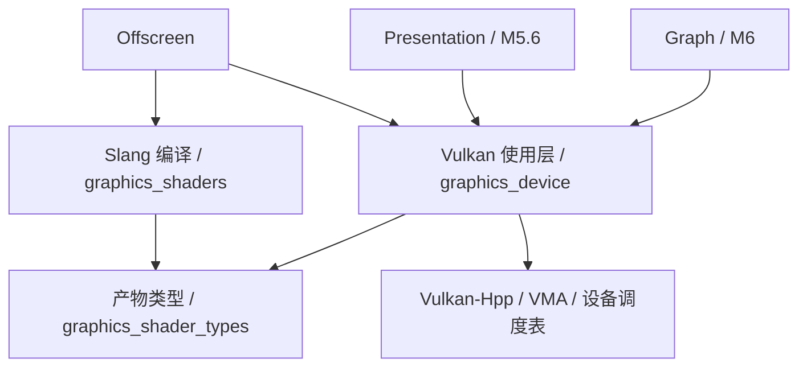

# Vulkan 使用层封装设计

## 目标与现状

本设计对应新增的 **M5.5 Vulkan 使用层封装**，位于已完成的离屏验收之后、窗口呈现之前。
本方案进入逐节实现；各节完成与验证状态见 Roadmap，未完成部分仍为实施目标，现行契约以
[设备](graphics-device.md)、[资源提交](graphics-resources.md)、[Shader](graphics-shaders.md)
和[离屏](graphics-offscreen.md)设计为准。阶段状态与编号迁移统一见 [Roadmap](../roadmap.md)。

目前底座已具备 Vulkan 1.4、Vulkan-Hpp RAII、VMA 和单队列完成跟踪，但还未覆盖日常使用流程：

| 实际调用点 | 当前负担 | 本阶段收口位置 |
| --- | --- | --- |
| [Offscreen.cpp](../../engine/graphics/offscreen/src/Offscreen.cpp) 的 draw | 手工拼接 ShaderModule、ImageView、固定管线状态及 dynamic rendering 结构 | 对象工厂、GraphicsPipelineDesc、RenderingDesc |
| 同文件的 dispatch | 手工合成 layout/pool/set、逐项更新 descriptor，再 bind/push/dispatch | PipelineLayout、BindingSet、ComputeEncoder |
| 同文件的 Work/execute | 另保留整组 vk::raii 对象；通过 Buffer/Image 间接保证设备寿命 | 统一对象控制块和提交保留列表 |
| [Resources.hpp](../../engine/graphics/device/include/dk/graphics/Resources.hpp) | 只有 copy/transition，其他录制需要借用 command_buffer 并手工 retain | 类型化录制入口、自动保活和受控原生扩展 |
| [Resources.cpp](../../engine/graphics/device/src/Resources.cpp) | 全图 layout 账本、保守全局 barrier；上传/读回需要反复组装 staging | 显式访问状态、范围同步、TransferBatch/ReadbackRequest |

目标是让常见调用表达“创建哪些资源、绑定什么数据、执行什么工作、何时取结果”。
重复的 Vulkan 创建结构、对象寿命、descriptor 写入和录制规则由底座承担。
`vk::Format`、usage/stage/access 枚举等适合直接表达 Vulkan 语义的值类型继续公开；
成功标准是流程集中与错误可定位，不是把所有 `vk::` 字样消除。

## 模块边界与依赖

保持 Vulkan 专用实现，不引入多后端 RHI、虚函数设备树或通用 `create<T>` / `set_state(any)`。
继续使用 `dk::graphics` 命名空间、既有 dispatcher 和 VMA；不新增或升级三方依赖。

| 位置与 target（规划） | 职责 | 依赖方向 |
| --- | --- | --- |
| `graphics/device`，既有 `dk::graphics_device` | 设备、资源/管线/绑定对象、命令录制、提交、传输 | PUBLIC Core、Memory、Vulkan 值类型及 shader_types；PRIVATE 保持现有装载/分配/Profiling 依赖 |
| `graphics/shader-types`，新增 `dk::graphics_shader_types` | 从现有头中提取 CompiledShader、阶段与最小反射数据；拥有型产物构造 | 仅 Core/Memory，不含 Slang、Vulkan、IO 或编译入口 |
| `graphics/shaders`，既有 `dk::graphics_shaders` | 离线编译、诊断与产物发布 | PUBLIC shader_types；编译器依赖留在本模块，旧 ShaderCompiler.hpp 重导出类型以兼容调用 |
| `graphics/offscreen`，既有 `dk::graphics_offscreen` | 组合资源和操作，验证图像/数据，提供原有同步入口 | 使用 device 与 shaders；不再实现通用 Vulkan 管线/描述符流程 |
| 后续 `graphics/presentation`、`graphics/graph` | 窗口交换链；Pass 依赖和同步规划 | 消费 device 公共接口，不依赖 offscreen 或其 src |

shader_types 是产物定义的提取，不改变 SPIR-V、JSON schema 或离线编译行为。
设备工厂因此能直接接收编译产物并校验布局，而只创建 Vulkan 资源的程序无需链接 Slang。
M5.5.1 已创建该 target；CPU-only runner 和独立 shader 配置的隔离约束保持。

device 内按职责拆分公开头与 `.cpp`：保留 Device.hpp/Resources.hpp，新增
`GpuObjects.hpp`、`Pipeline.hpp`、`Bindings.hpp`、`CommandEncoder.hpp`、`Transfer.hpp`。
这是同一 target 内的实现分组，不建立相互依赖的微型 target；不向消费者公开内部控制块。

依赖流为：调用者 → Offscreen / Presentation / Graph → Vulkan 使用层 → Hpp / VMA / Device。
Graph 负责跨 Pass 排序、裁剪、transient 生命周期与同步计划；使用层负责执行给定顺序、
校验局部状态并保证对象到 GPU 完成前有效。使用层不读取 Scene/Assets，也不选择业务 Pass。



## 对象与创建接口

### 统一工厂与所有权

`SubmissionQueue::resources()` 返回借用该队列的 `ResourceFactory` 视图，集中提供具名工厂方法。
现有 `queue.create_buffer/create_image` 保留为转发入口；工厂不额外拥有队列，不产生资源→队列引用环。
Device 保持初始化和能力查询职责，不把所有创建方法继续加进 Device。

| 拥有型对象 | 描述/创建入口 | 内部依赖和调用者获得的简化 |
| --- | --- | --- |
| Buffer / Image | BufferDesc / 扩展 ImageDesc | 复用 VMA，统一描述/能力/范围检查 |
| ImageView / Sampler | create_view(image, desc) / create_sampler(desc) | view 保留 image；默认参数和能力检查集中 |
| ShaderModule | create_shader(compiled) | 复制入口、阶段、最小反射元数据，创建 SPIR-V module；返回后可释放编译产物 |
| PipelineLayout | create_pipeline_layout(shader_entries) | 跨阶段合并反射并创建 set layouts / push ranges |
| GraphicsPipeline / ComputePipeline | create_graphics_pipeline(desc) / create_compute_pipeline(desc) | 管线拥有 layout；管线可跨多次录制复用 |
| BindingSet | create_bindings(layout, set_index, writes) | 拥有 descriptor 分配、layout 与全部被绑定资源 |

公开 owner 均 move-only，内部控制块保存同一设备寿命与 owner 身份；`handle()` 只借用。
工厂拒绝移后/已关闭队列、关闭中的 Memory resource 和 lost 设备。
管线、view、sampler 等即使没有任何 Buffer/Image 同时存活，也必须独立延长设备/dispatcher 寿命。
工厂参数中的 span/string_view 只借用到调用返回；对象持久字段与控制块归调用者 Memory 域。
VMA 对象保持专用销毁方式，普通对象内部继续使用 vk::raii，不重复拥有原生句柄。

首版不引入全局缓存：显式持有 Pipeline/Sampler/Layout 即可复用，避免每次 dispatch 重建。
描述符池按队列域分页、有容量上限、耗尽返回可定位错误；每个分配持有 pool page。
M5.5.2 首版上限为 64 页、每页 32 个同类 descriptor 数量的 set、单 set 4096 个 descriptor；
设备限制仍需同时满足。页由活跃 BindingSet 拥有，队列只保存弱目录；释放后可复用目录位置。
池只有全部 allocation 释放后才能重置/回收；不按 CPU 帧号 reset。
使用 Hpp DescriptorSet owner 时池启用 `eFreeDescriptorSet`，释放顺序为 set→pool→device；
后续若改为整页释放，须同时换成非拥有型 set，不能混用两种释放策略。

### 资源范围与默认值

ImageDesc 扩展为 2D/2D array、extent、mip_levels、array_layers、format、usage；首版仍 sample=1。
ImageViewDesc 表达 aspect、mip/layer 范围与 2D/array 视图；不隐式创建全套 view。
保留现有五种 color 格式，补充 `D32_SFLOAT` 深度 attachment 路径；每种组合先查询 format/usage 能力，
不因为枚举合法就假定硬件支持。color 传输按每个 mip 的 extent 和数据步长检查；深度读回另列为暂缓。

SamplerDesc 明确 filter、address mode、LOD 范围，默认关闭 anisotropy/compare；
首版拒绝需要额外 feature 的设置，不悄悄改变 Device 的 feature 启用集合。
不支持的 3D/cube、压缩格式、stencil、MSAA/resolve 明确返回 not_supported，之后按真实用例扩展。

### 布局、管线与绑定

布局按 `(set, binding)` 合并 shader 反射：type/count 必须相容，stage flags 求并集；
uniform block 大小形成绑定范围的下限要求，不参与伪造 Vulkan 布局兼容性。
固定数组与多个 set 纳入首版，set 编号空洞用空 layout 占位；限制来自设备 limits。
push ranges 先为每个 shader stage 求一个覆盖所需字节的合法、4 字节对齐范围，再将完全相同范围合并 stages；
不同范围可在 stages 不交叠时重叠，同一 stage 不重复出现在多个 range 中。
不支持未定长数组、bindless、update-after-bind、dynamic offsets 或 immutable sampler。

GraphicsPipelineDesc 只暴露稳定的需求字段：vertex/fragment、layout、顶点 binding/attribute、
拓扑、光栅化、深度测试/写入、blend、color/depth 格式和 sample count。
默认 triangle list、fill、无剔除、无 blend、无 depth、单 color、sample=1，viewport/scissor 为动态状态；
首版支持 vertex/index buffer、多实例、单 color 加可选 depth，不默认为更多动态状态开启 feature。
ComputePipelineDesc 包含 compute shader、layout；工作组大小来自产物，dispatch 数量由调用者指定。
检查阶段/入口、格式特性、limits、启用 feature 和布局覆盖关系；不把最小反射当作完整 SPIR-V 验证器。

BindingWrite 用带类型的 buffer slice、sampled/storage image view、sampler，包含 binding 和数组元素范围。
一次创建检查缺失/重复项、count/type、owner、usage、offset/range/对齐及 image 声明布局，
首版要求所建 set 的所有声明元素都有有效数据。descriptor 写入不执行 image transition。
BindingSet 创建后不可变：改绑定生成新对象，旧对象继续服务 recording/pending；
避免使用者自行判断何时能安全 updateDescriptorSets。
被绑定 buffer 的字节仍可在不忙时更新；绑定持有的寿命引用与 recording/pending 的忙引用分开，
否则一个长期存活的 BindingSet 会错误地禁止所有 CPU write。

布局记录规范化完整签名，兼容检查比较 set 0…N 的定义和 push ranges；hash 只加速查找，不能代替相等检查。
切换不兼容管线时 encoder 使相关绑定/常量有效性失效，要求调用者重新设置，防止继承错误状态。
同一 set 的资源可以复用于多个兼容管线，工厂不根据 shader 文件名推断兼容。

## 命令录制与同步

### 类型化录制

`CommandBatch` 继续代表一次可放弃的录制和唯一提交单位；借用 encoder 不创建第二个 command buffer。
提供以下入口，返回值继续使用 `dk::Result`：

- batch：范围 copy、fill/clear、prepare、显式 barrier、begin_rendering、compute、upload/readback。
- RenderEncoder：bind_pipeline、bind_sets、push_constants、vertex/index buffers、viewport/scissor、draw/draw_indexed、end。
- ComputeEncoder：bind_pipeline、bind_sets、push_constants、dispatch；另提供等价的单次 dispatch 便利函数。

begin_rendering 自动展开 attachments 的 view/layout/load/store/clear 和 render area；
默认 viewport/scissor 覆盖 render area，调用者可覆盖。
所有 bind/copy/attachment 操作自动保留相关对象及其资源闭包，不要求普通调用者手动 retain。
首版只处理一个 primary command buffer；rendering scope 不可嵌套，compute/copy/barrier 只在 scope 外记录。
encoder 与 batch 的活跃代次绑定；end/移动/提交后继续调用返回 invalid_state，不能持有悬空引用。
RenderEncoder 析构只结束仍有效的本地 scope，不提交也不等待；显式 end 可及时报告状态错误。
提交前必须已结束 rendering；绘制前校验管线、绑定、push bytes、顶点/索引范围及 attachment 格式匹配。

### 一份状态账本，两种调用粒度

保活、同步、GPU 完成是三件事；bind/retain 本身不建立内存依赖。
引入 `ResourceUse`：资源、buffer 范围或 image 子资源、stage/access、image layout；
提供 transfer_src/dst、vertex/index、uniform_read、sampled_read、storage_read/write、color/depth_attachment 等便利构造，
shader 访问必须指定 stage 和读写意图，不从 descriptor type 猜测 shader 是否写入。

简单调用先 `batch.prepare(uses)`，将局部账本状态转换成所需状态并发出 synchronization2 barrier。
每个依赖步骤之前都要 prepare；连续两个 dispatch 即使 layout 不变，写后读/写仍可能需要 barrier。
bind/draw/dispatch 校验资源处于已声明的范围和状态，资源访问后将相应声明标为已使用，
下一次有依赖的访问必须重新 prepare；只读连续访问可以合并。
对多 draw 的 rendering scope，先声明整个 scope 的输入/attachment 集合，全部 barrier 在 beginRendering 之前记录；
首版不支持 scope 内 storage 写入后再读或 attachment feedback loop，遇到这类需求需结束 scope 再 prepare。

Graph 走 `batch.barrier(BarrierBatch)` 与同一组底层 copy/encoder 接口，显式给出 before/after 状态。
这条路径只校验范围/账本一致性、发出给定 barrier 并更新同一账本，不再额外插入 prepare 的 barrier；
Graph 无需经带隐式传输准备的便利函数，不建立另一套 Vulkan command recording。
显式 barrier 的访问完成后也遵循同一状态校验规则；原来的保守 copy/transition 仅作为兼容入口保留，
迁移后调用者选用明确的便利路径或计划路径，不为同一次访问重复准备。

状态账本首版 Buffer 按整对象保守跟踪，API 仍验证 byte range；Image 按 aspect/mip/layer 跟踪。
增加按范围查询状态的接口，返回子资源状态快照；在 M5.5.3 迁移现有测试/消费者对单值 Image::layout() 的查询，
再废弃该单值入口，不能用 Undefined 假装多个不同的 layout。
每个被跟踪资源同时只允许一个未提交 batch 预约（包括 Buffer），避免并行录制拿到过时的起始状态；
相互独立的资源仍可录制到不同槽。成功提交后释放预约，后续 batch 可依单队列顺序继续使用，
无需等上一份 GPU 工作完成。资源的“已提交状态”不等同于“已经完成”。
未提交批次的预测状态只存在本地；放弃/失败不发布。多个只读来源累积 stages/access，
不能只记最后一次读取而丢掉后续写入所需的执行依赖。
新 image 的 Undefined 表示内容无效；不能用它绕过已有写入的执行依赖。清屏/完整覆盖可建立有效内容，
load/read 必须有可用内容；首版采用保守的子资源内容有效标记，局部写入不自动证明其余区域已初始化。
load/store 的 discard 会使相应内容标记失效，只有提交成功才发布；render area 的局部 clear 不证明整图有效。

主机写入通过既有 map/flush 路径记录 host 状态；readback 准备 transfer→host 可见性，
确认提交完成后才 invalidate/read。普通接口不调用 waitIdle；保守 barrier 的优化留到有测量之后。

## 上传、读回与调用示意

`TransferBatch` 借用 CommandBatch，封装 staging Buffer 的分配、CPU 数据复制、区域 copy 和必要 prepare。
上传接受 byte span 与目标 buffer slice/image region；返回后输入 span 可释放，staging 进入批次保留列表。
首版用独立 staging allocation，避免提前引入 ring buffer 的空间退休机制；后续可保持接口改为有界池。
多次传输可合到一次 submit，不为每个 upload 隐式提交/等待。

`readback` 返回 move-only `ReadbackRequest`，拥有 staging 与结果描述；它在 submit 成功时绑定完成状态，
submit 失败/批次放弃后变为 cancelled，未提交时不能等待或读取。
提交后 pending 槽独立保留 staging，用户丢弃 request 不会取消 GPU 工作或提前释放 allocation。
request 持有独立完成记录和设备寿命，不强持有整个 queue；queue 正常关闭先排空并更新记录，
因此 request 可在 queue 销毁后读取已完成内容。队列仍存活时由 poll/wait 推进记录。
`try_read` 未完成返回 not_ready 状态；超时保留 request/pending，lost 返回终态错误，均不返回未完成字节。
若 Core 无对应错误码，not_ready 使用返回值状态表示，不新增含义混杂的异常。
depth/压缩格式的通用 byte readback 首版拒绝，不能沿用每像素四字节的假设。

以下是拟议的调用形状，不是已存在或可编译的示例；`TRY/TAKE` 仅表示 Result 传播。
`TAKE` 解包成功值，错误时直接返回；省略初始化及描述构造，与未来宏命名无关。

```cpp
auto factory = queue.resources();
auto shader = TAKE(factory.create_shader(compiled_compute));
auto layout = TAKE(factory.create_pipeline_layout({shader}));
auto pipeline = TAKE(factory.create_compute_pipeline({shader, layout}));
auto storage = TAKE(factory.create_buffer(storage_desc));
auto bindings = TAKE(factory.create_bindings(layout, 0, {storage_binding(0, storage)}));
// shader/layout/pipeline/bindings 可在多次任务间复用。

auto batch = TAKE(queue.begin());
TRY(batch.upload(storage, input_bytes));
TRY(batch.prepare({storage_read_write(storage, vk::ShaderStageFlagBits::eCompute)}));
TRY(batch.dispatch(pipeline, bindings, constants, groups));
auto result = TAKE(batch.readback(storage));
auto ticket = TAKE(queue.submit(std::move(batch)));
if (!TAKE(queue.wait(ticket, timeout_ns))) return pending_result;
return result.try_read(output_bytes);
```

绘制对应的核心流程为 `prepare(输入和附件) → begin_rendering(desc) → bind/draw → end → readback`。
常见路径不出现 Vulkan CreateInfo、descriptor pool 分配、裸 bind 命令或手工 pending work 对象集合。
资源选择、数据/格式、同步意图和等待策略仍由调用者明确给出。

## 提交点、失败和扩展边界

对象依赖为 view→image、bindings→layout/pool/资源、pipeline→layout、所有控制块→device lifetime；
batch/pending slot 持有使用到的控制块，资源不反向持有 batch/queue。
ShaderModule 只需活到 pipeline 创建完成；管线保留拷贝后的接口元数据，不必永久保留原模块。
销毁用户包装只减引用；最终 Vulkan 销毁按依赖逆序，并在 GPU 完成之后进行。

| 操作/失败位置 | 发布规则与保留状态 |
| --- | --- |
| 工厂校验、创建或反射合并失败 | 不发布半成品；回收新建子对象，不修改已有对象 |
| 录制方法校验/可传播分配异常 | 在发出该方法的首条原生命令前完成校验和保留列表准备；失败保持此前有效录制 |
| 已发出部分原生命令后无法完成方法 | batch 标记 invalid，只能放弃，submit 拒绝；不承诺撤销 command buffer 中的单条命令 |
| 结束录制或 vkQueueSubmit2 失败 | 不发布 ticket、全局状态或 readback 成功；消费/放弃 batch 并释放预约 |
| vkQueueSubmit2 成功 | 唯一提交点；票据、状态、请求绑定、保留列表转移均已预分配且 noexcept |
| wait 超时/可重试错误 | pending 与全部对象继续保留；不复用 pool/槽，不伪造完成 |
| device lost | 整个共享设备域终态，停止新工作；沿用既有 lost 清理策略，无成功数据 |

工厂中的 device lost 也必须标记共享设备域，不能只在 submit/wait 才感知。
Vulkan 错误在公共边界转成 Result，保留操作名、VkResult 数值/符号及对象诊断名；
std::bad_alloc 保持现有 Memory 异常约定，不承诺 noexcept STL OOM 可恢复。
所有访问仍由调用者串行化；线程安全并行录制、后台编译/提交不属于本阶段。
close、析构等待失败与 fail-stop 策略沿用资源设计，普通对象析构不各自 waitIdle。

保留 `Device::logical_device()` / 借用句柄供底层互操作。新增显式 `unsafe_record` 扩展作用域：
先声明保留对象与资源 before/after 状态，再借用 command buffer；退出后使缓存的 pipeline/binding/dynamic state 失效。
未知扩展状态不能自动推断；未声明/无法表达的状态变化拒绝继续受管录制，回调异常使 batch invalid。
禁止在扩展内 end/reset/submit command buffer、销毁受管对象或 signal 内部 timeline。
M5.5.5 将当前公开 command_buffer() 标记弃用并迁移常规消费者；底层实现及专门故障/互操作 probe 仍可直接调用 Vulkan。
原生扩展的声明真实性由调用者负责，封装不能验证任意原生命令的实际访问。

M5.6 的 WSI 适配使用独立 external image 引用：保留 swapchain generation owner，
不交由 VMA 销毁，并显式导入/导出 layout 与外部同步。M5.5 不提供任意裸 VkImage 的无所有者接管。
submit 的 acquire wait/render-finished signal 接口在 M5.6 结合 acquire/present 状态机实现；
render submission 完成不代表 present wait semaphore 已消费，交换链重建和信号量回收由 presentation 验证。
窗口所需 instance/device extensions、present family 选择仍归 M5.6，不从本设计推定已支持。

## 实施拆分与独立验收

以下阶段顺序与状态由 [Roadmap](../roadmap.md) 维护；本表规定每节需要交付和证伪的行为。
实现各节时更新对应现行模块设计与独立开发记录，不把本设计稿当作 GPU 验收证据。

| 子阶段 | 主要文件范围 | 独立验收 |
| --- | --- | --- |
| M5.5.1 对象与寿命基础 | device 控制块/工厂、GpuObjects、shader-types 提取 | sampler/ShaderModule 无 Buffer/Image 配套时也可正确保活设备，view 保活 image；移动/创建中途失败、对象/设备逆序清理；只用 device 不链接 Slang |
| M5.5.2 管线与绑定 | Pipeline、Bindings、最小反射合并 | graphics/compute 复用、多 set/固定数组、纹理+sampler/uniform/storage；布局冲突与范围错误在提交前拒绝；旧 BindingSet 在新版本创建后仍有效 |
| M5.5.3 录制与同步 | CommandEncoder、资源范围/状态账本 | indexed draw、depth、双 dispatch、upload→compute→draw；多 mip/layer 的独立状态、同 layout 写后读、RAW/WAR/WAW、放弃/失败回滚及 Graph 显式 barrier 路径 |
| M5.5.4 传输与读回 | Transfer、完成记录与 staging 保留 | 多上传一次提交、color 子区域/多 mip 读回、超时/请求丢弃/queue 销毁后完成读取；host 可见性和所有者清理 |
| M5.5.5 消费迁移与验收 | Offscreen、相关 probe、指南 | 原三角形/compute 输出不变；常规消费者无直接 Vulkan 对象创建/descriptor 更新/命令录制；重复运行/失败恢复/销毁均零相关验证错误 |

CPU 测试优先覆盖 descriptor/layout 合并、资源范围、feature/limit 拒绝、encoder 状态机和状态计划；
内部 seam 覆盖创建失败、保留列表分配失败、submit/wait 错误，不新增生产故障开关。
GPU probe 覆盖新增真实资源和读写链路，开启同步验证；测试提前销毁用户 pipeline/view/bindings 包装，
确认 pending 期间仍有效，完成后 VMA 与 Memory 无残留。环境缺失返回 77，不能记为 GPU 通过。

迁移验收检查直接 Vulkan 调用的所在层：device 私有实现与专门互操作 probe 允许；
Offscreen 的公共执行路径和新增使用示例不再创建 vk::raii 对象、拼 vk::*CreateInfo、
updateDescriptorSets 或调用原生 command buffer。该检查结合输出回归和同步验证，不单以代码行数衡量。
只运行当节受影响测试；最终定向复验 device/resources/shaders/offscreen、CPU runner 与独立 shader 配置。
纯设计交付只运行文档/链接检查，不运行引擎构建，也不声称 GPU 行为已验证。

## 取舍与暂缓项

首版采用不可变绑定、显式管线复用、单队列、Buffer 粗粒度跟踪和独立 staging，先保证可理解的调用与寿命。
M5 不建设通用 RHI、跨 Pass 自动调度、bindless/descriptor buffer、shader object、完整反射、
pipeline 持久缓存/热重载、多队列 ownership、aliasing 或 Tracy GPU capture。
管线缓存、staging 池及更细 Buffer 同步可在测量后优化；能力开放须伴随设备 feature 检查和真实用例。
具体头文件拆分与命名允许在各节实现时微调，所有权、提交点、无 Slang 反向依赖和 Graph 分工为本稿核心约束。

## 依据与关联

状态规划以 Khronos [synchronization2 示例](https://docs.vulkan.org/guide/latest/synchronization_examples.html)
为依据，特别区分访问依赖、布局变化和 host 读回；描述符兼容与更新约束见
[Descriptor Sets](https://docs.vulkan.org/spec/latest/chapters/descriptorsets.html)。
RAII 内部所有权与 descriptor pool 释放策略参考
[Vulkan-Hpp RAII 指南](https://github.com/KhronosGroup/Vulkan-Hpp/blob/main/docs/VkRaiiProgrammingGuide.md)；
呈现完成的独立边界参考 [Swapchain Semaphore Reuse](https://docs.vulkan.org/guide/latest/swapchain_semaphore_reuse.html)。
这些资料用于设计核对，不改变当前固定依赖版本或宣称已经实现相关功能。

关联现行契约：[整体架构](architecture.md)、[设备](graphics-device.md)、[资源与提交](graphics-resources.md)、
[Shader](graphics-shaders.md)、[离屏](graphics-offscreen.md)。现状证据见
[0045](../development/0045-graphics-resources-submission.md)、[0047](../development/0047-offscreen-execution.md)
和 [0048](../development/0048-vulkan-14-baseline.md)。实现记录从
[0049 M5.5.1](../development/0049-vulkan-object-foundation.md) 开始，后续各节独立留档。
